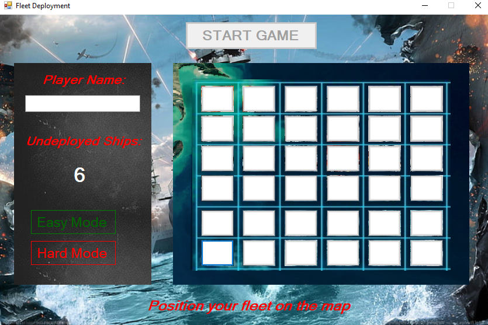
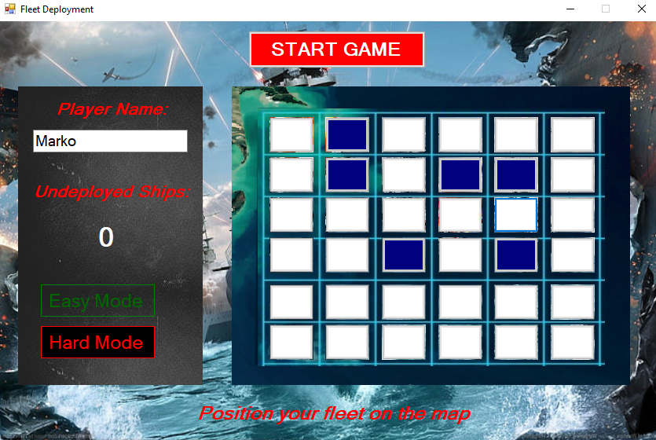
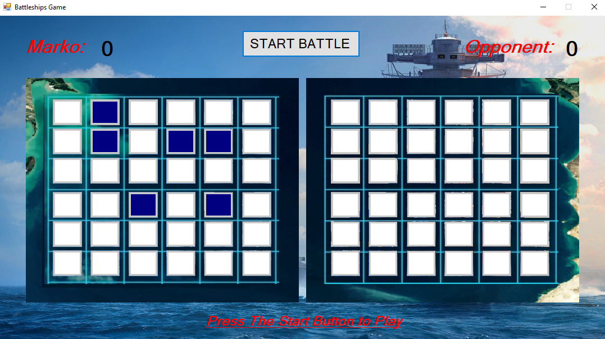
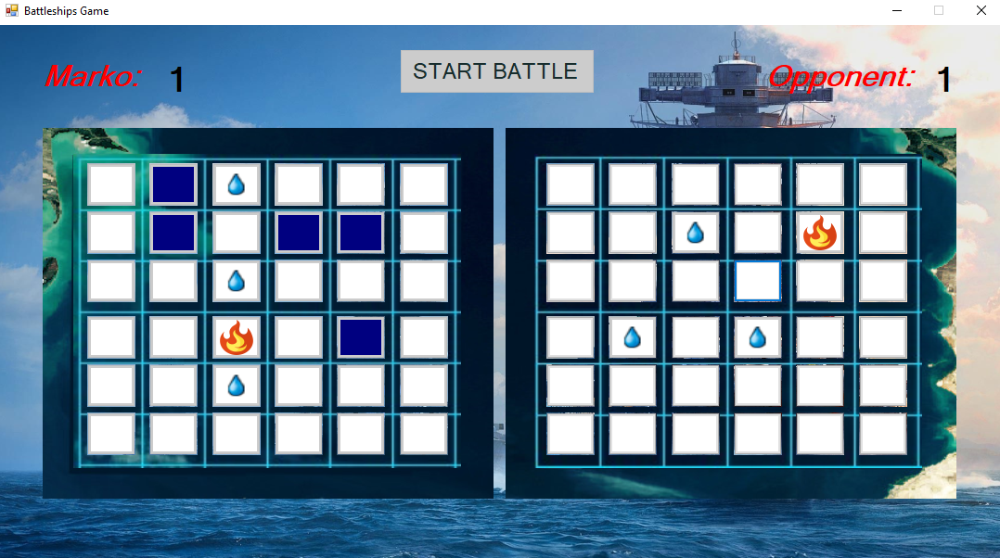
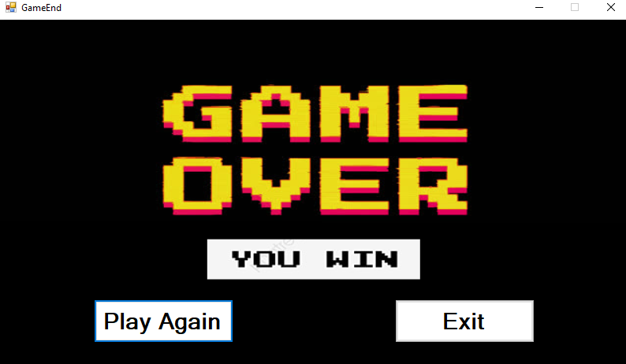
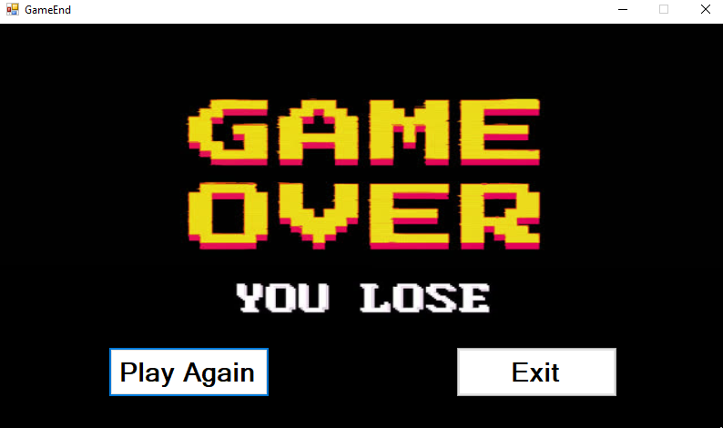

# BattleShips
VP_Project strategy game Battleships

Проект направен од: 
 - Марко Неделковски

**Battle Ships** е класична стратегиска игра која симулира поморска борба помеѓу двајца играчи или помеѓу играч и компјутер.
Целта на играта е да се потонат бродовите на противникот пред тој да има можност да го стори истото.

Дизајнот на самата игра е инспирација од веќе постоечки верзии со тоа што некои елементи се имплементирани на сопствен начин.

#### Начин на играње:
Кога се стартува играта се отвора форма која претставува главното мени на апликација.



Во ова мени корисникот го внесува своето **име**, го одбира нивото на **difficulty(easy | hard)** и е потребно да ги позиционира своите бродови на
некои од полињата прикажани на мапата. 
По овие чекори копчето за започнување на играта ке му биде достапно.




Доколку сите овие чекори се исполнети и успешно се стартува играта, на играчот му се прикажува главната форма на играта каде што и всушност играта започнува.


На овој екран се претставени двете мапи со полиња,
левата мапа претставуваат одбраните локации на бродови кои корисникот ги одбрал, а десната мапа оние на противникот.

#### Почеток на играта (притискање старт)
Играчот е потребно да го притисне копчето **"Start Battle"** по што играта започнува.
Прв на потег е играчот со тоа што е потребно да одбере некое противничко поле за уништување.



Играта продолжува се додека некои од играчите има бродови кои не се потонати.

Доколку играчот ги потоне сите противнички бродови, се отвора нова форма на која што е известен за својата освоена **победа** и има можност повторно игра или пак да ја затвори апликацијата.



Во спротивно доколку **изгуби** го дочекува слична форма во која што повторно ги има истите опции.



### Кратка структура на апликацијата:
Класата **Player** содржи неколку properties меѓу кои **името на играчот**, бројот на освоени поени, бројот на бродови, како и **листа од мапата со полиња на играчот**.
```c#
public class Player
    {
        public string Name { get; set; }
        public List<Button> FieldsList { get; set; }
        public int Points { get; set; }
        public int Hits { get; set; }
        public int Misses { get; set; }
        public int NumberOfShips { get; set; }
        public int DeployedShips { get; set; }
        public int RemainingShips { get; set; }

        public Player(string name, int numberOfShips)
        {
            Name = name;
            Points = 0;
            Hits = 0;
            Misses = 0;
            FieldsList = new List<Button>();
            NumberOfShips = numberOfShips;
            DeployedShips = 0;
            RemainingShips = numberOfShips;
        }
    }
```

Класата **Form1** ја содржи главната логика на апликацијата. Во неа се наоѓаат два објекти од класата **Player** како и **Timer** кој му кажува 
на компјутерот(противникот) кога да го изведе својот напад. Исто така содржи и **SoundPlayer** кој служи за одредени звучни ефекти.

```c#
        Random rand = new Random();
        public SoundPlayer SoundPlayer { get; set; }

        public Player Player { get; set; }
        public Player Opponent { get; set; }
        public bool ReadyToAttack { get; set; }

        public bool HardDificulty { get; set; }
```


Во класата **Form1** исто така се наоѓа и методот преку кои компјутерот(противникот) ги одбира своите позиции на мапата со полиња.
```c#
        public void OpponentPositionPicker() 
        {
            List<int> availableShipLocations = Enumerable.Range(0, Opponent.FieldsList.Count).ToList();
            for(int i=0; i<Opponent.NumberOfShips; i++)
            {
                int shipLocationIndex = rand.Next(availableShipLocations.Count);
                int shipLocation = availableShipLocations[shipLocationIndex];

                Opponent.FieldsList[shipLocation].Tag = "OpponentShip";
                availableShipLocations.RemoveAt(shipLocationIndex);
            }
        }
```

Доколку играчот одбере да игра на **Easy Mode** тогаш компјутерот(противникот) одбира една рандом позиција за напад од листата на сеуште валидни полиња од мапата.
Тоа се извршува со помош на **Random** објектот.
```c#
    int easyAttackPosition = rand.Next(Player.FieldsList.Count);
```

Во спротивно доколку играчот одбере да игра на **Hard Mode** тогаш компјутерот(противникот) најизменично одбира едно поле од сите достапни(сеуште валидни позиции)
или пак само од полињата на кои што се позиционирани **бродовите на играчот.**
```c#
    int hardattackposition = playerShipPositions[rand.Next(playerShipPositions.Count)];
```


